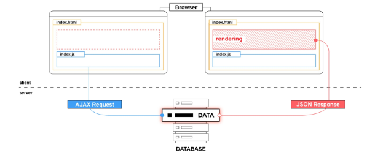
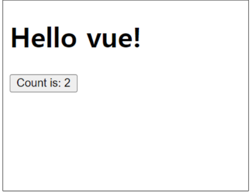

# Front-end Development

## Client-side frameworks

Front-end Development
- 웹사이트와 웹 애플리케이션의 사용자 인터페이스(UI)와 사용자 경험(UX)을 만들고 디자인하는 것
- > HTML, CSS, JavaScript 등을 활용하여 사용자가 직접 상호작용하는 부분을 개발

Client-side frameworks
- 클라이언트 측에서 UI와 상호작용을 개발하기 위해 사용되는 JavaScript 기반 프레임워크


Client-side frameworks가 필요한 이유 1
- "웹에서 하는 일이 많아졌다."
- 단순히 무언가를 읽는 곳 -> 무언가를 하는 곳

- 사용자는 이제 웹에서 문서만을 읽는 것이 아닌 음악을 스트리밍하고, 영화를 보고, 원거리에 있는 사람들과 텍스트 및 영상 채팅을 통해 즉시 통신하고 있음
- 이처럼 현대적이고 복잡한 대화형 웹 사이트를 "웹 애플리케이션(web applications)"이라 부름
- JavaScript 기반의 Client-side frameworks의 출현으로 매우 동적인 대화형 애플리케이션을 훨씬 더 쉽게 구축할 수 있게 됨

Client-side frameworks가 필요한 이유 2
- "웹에서 하는 일이 많아졌다."
- > "다루는 데이터가 많아졌다."

- 만약 친구가 이름을 변경했다면?
- 친구 목록, 타임라인, 스토리 등 친구 이름이 출력되는 모든 곳이 함께 변경되어야 함
- 애플리케이션의 기본 데이터를 안정적으로 추적하고 업데이트(렌더링, 추가, 삭제 등) 하는 도구가 필요
- > 애플리케이션의 상태를 변경할 때마다 일치하도록 UI 를 업데이트해야 한다는 것

Vanilla JS만으로 모든 데이터를 조작한다면...
```html
<label for="inputArea">Username: </label
<input type="text" id="inputArea">
<hr>

<h1>안녕하세요 <span id="username1"></span></h1>

<div>
    <span id="username2"></span>님의 친구 목록
</div>

<div>
    <span id="username3"></span>님의 알림 목록
</div>

<div>
    <span id="username4"></span>님의 친구 요청 목록
</div>
```
**불필요한 코드의 반복**
```js
const inputArea = document.querySelector('#inputArea')
const initialText = "Unknown"

const username1 = document.querySelector('#username1')
const username2 = document.querySelector('#username2')
const username3 = document.querySelector('#username3')
const username4 = document.querySelector('#username4')

username1.innerText = initialText
username2.innerText = initialText
username3.innerText = initialText
username4.innerText = initialText

inputArea.addEventListener("change", function (event) {
    const newUsername = event.target.value

    username1.innerText = newUsername
    username2.innerText = newUsername
    username3.innerText = newUsername
    username4.innerText = newUsername
})
```

## SPA

Single Page Application
- 페이지 한 개로 구성된 웹 애플리케이션

1. 서버로부터 필요한 모든 정적 HTML을 처음에 한번 가져옴
2. 브라우저가 페이지를 로드하면 Vue 프레임워크는 각 HTML 요소에 적절한 JavaScript코드를 실행(이벤트에 응답, 데이터 요청 후 UI 업데이트 등)
  - ex) 페이지 간 이동 시, 페이지 갱신에 필요한 데이터만을 JSON 으로 전달받아 페이지 일부 갱신
  - Google Maps, 인스타그램 등의 서비스에서 갱신 시 새로고침이 없는 이유

- 웹 애플리케이션 초기 로딩 후 새로운 페이지 요청 없이 동적으로 화면을 갱신하며 사용자와 상호작용하는 웹 애플리케이션
- > CSR 방식

Client-side Rendering (CSR)
- 클라이언트에서 화면을 렌더링 하는 방식

Client-side Rendering 방식
1. 브라우저는 페이지에 필요한 최소한의 HTML 페이지와 JavaScript를 다운로드 
2. 그런 다음 JavaScript를 사용하여 DOM을 업데이트하고 페이지를 렌더링


Client-side Rendering 장점
1. 빠른 속도
  - 페이지의 일부를 다시 렌더링할 수 있으므로 동일한 웹 사이트의 다른 페이지로 이동하는 것이 일반적으로 더 빠름
  - 서버로 전송되는 데이터의 양을 최소화
  
2. 사용자 경험
  - 새로고침이 발생하지 않아 네이티브 앱과 유사한 사용자 경험을 제공
  
3. Front-end와 Back-end의 명확한 분리
  - Front-end는 UI 렌더링 및 사용자 상호 작용 처리를 담당 & Back-end는 데이터 및 API 제공을 담당
  - 대규모 애플리케이션을 더 쉽게 개발하고 유지 관리 가능

Client-side Rendering 단점
1. 초기 구동 속도가 느림
  - 전체 페이지를 보기 전에 약간의 지연을 느낄 수 있음
  - JavaScript가 다운로드, 구문 분석 및 실행될 때까지 페이지가 완전히 렌더링 되지 않기 때문
2. SEO(검색 엔진 최적화) 문제
  - 페이지를 나중에 그려 나가는 것이기 때문에 검색에 잘 노출되지 않을 수 있음

# Vue

What is Vue ?
- 사용자 인터페이스를 구축하기 위한 JavaScript 프레임워크
- 2014년 발표 - Evan You
  - 학사 - 미술, 미술사 / 석사 - 디자인 & 테크놀로지 전공 / Angular 개발팀 출신
- 2023년 기준 최신 버전은 "Vue 3"
  - https://vuejs.org/

- > Vue 2 문서에 접속하지 않도록 주의

Vue를 학습하는 이유
1. 쉬운 학습 곡선 및 간편한 문법
  - 새로운 개발자들도 빠르게 학습할 수 있음
2. 반응성 시스템
  - 데이터 변경에 따라 자동으로 화면이 업데이트되는 기능을 제공
3. 모듈화 및 유연한 구조
  - 애플리케이션을 컴포넌트 조각으로 나눌 수 있음
  - 코드의 재사용성을 높이고 유지보수를 용이하게 함

SSAFY에서의 Vue
- Vue는 React나 Angular 대비 간결하고 직관적인 문법을 가지고 있어 초기 학습이 상대적으로 원활
  - 짧은 시간내에 효율적으로 결과물을 만들어 낼 수 있음

- 거대하고 활발한 커뮤니티를 가지고 있어 풍부한 문서, 튜토리얼, 예제 및 다양한 리소스를 공유 받을 수 있음
  - 최신 업데이트 및 트렌드를 공유함으로써 지속적인 학습을 촉진

Vue의 2가지 핵심 기능
- 첫 코드 작성 및 결과

```html
<!-- first-vue.html -->

<div id="app">
    <h1>{{ message }}</h1>
    <button @click="count++">
    Count is: {{ count }}
    </button>
</div>
```
```js
<script src="https://unpkg.com/vue@3/dist/vue.global.js"></script>
<script>
    const { createApp, ref } = Vue

    const app = createApp({
        setup() {
            const message = ref('Hello vue!')
            const count = ref(0)

            return {
                message,
                count
            }
        }
    })

    app.mount('#app')
</script>
```

- 첫 코드 작성 및 결과



1. 선언적 렌더링 (Declarative Rendering)
  - HTML을 확장하는 템플릿 구문을 사용하여 HTML이 JavaScript 데이터를 기반으로 어떻게 보이는지 설명할 수 있음

2. 반응형 (Reactivity)
  - JavaScipt 상태 변경을 자동으로 추적하고 변경사항이 발생할 때 DOM을 효율적으로 업데이트


## Vue Tutorial

Vue를 사용하는 방법
1. CDN 방식
2. NPM 설치 방식
  - CDN 방식 이후 진행

첫번째 Vue 작성하기
- CDN 및 Application instance 작성

```js
// vue-instance.html

<script src="https://unpkg.com/vue@3/dist/vue.global.js"></script>
<script>
    const { createApp } = Vue

    const app = createApp({})

    app.mount('#app')
</script>
```

- Application instance
  - 모든 Vue 애플리케이션은 createApp 함수로 새 Application instance를 생성하는 것으로 시작

- app.mount()
  - 컨테이너 요소에 애플리케이션 인스턴스를 탑재 (연결)
  - 각 앱 인스턴스에 대해 mount()는 한 번만 호출할 수 있음

ref()
- 반응형 상태(데이터)를 선언하는 함수 (Declaring Reactive State)

ref 함수
- 인자를 받아 .value 속성이 있는 ref 객체로 래핑(wrapping)하여 반환
- ref로 선언된 변수의 값이 변경되면, 해당 값을 사용하는 템플릿에서 자동으로 업데이트
- 인자는 어떠한 타입도 가능
```js
const { createApp, ref } = Vue

const app = createApp({
    setup() {
        const message = ref('Hello vue!')
        console.log(message) // ref 객체
        console.log(message.value)  // Hello vue!
    }
})
```

- 템플릿의 참조에 접근하려면 setup 함수에서 선언 및 반환 필요
- 템플릿에서 ref를 사용할 때는 .value를 작성할 필요 없음 (automatically unwrapped)

```html
<!-- vue-instance.html -->

<div id="app">
    <h1>{{ message }}</h1>
</div>
```

```js
const app = createApp({
    setup() {
        const message = ref('Hello vue!')
        return {
            message
        }
    }
})
```

ref()
- 반응형 상태(데이터)를 선언하는 함수
- > 반응형을 가지는 참조 변수를 만드는 것 (ref === reactive reference)

Vue 기본 구조
- createApp()에 전달되는 객체는 Vue 컴포넌트 (Component)
- 컴포넌트의 상태는 setup() 함수 내에서 선언되어야 하며 객체를 반환해야 함
```js
const app = createApp({
    setup() {
        const message = ref('Hello vue!')
        return {
            message
        }
    }
})
```

템플릿 렌더링
- 반환된 객체의 속성은 템플릿에서 사용할 수 있음
- Mustache syntax(콧수염 구문)를 사용하여 메시지 값을 기반으로 동적 텍스트를 렌더링
```html
<div id="app">
    <h1>{{ message }}</h1>
</div>
```

```js
const app = createApp({
    setup() {
        const message = ref('Hello vue!')
        return {
            message
        }
    }
})
```

- 콘텐츠는 식별자나 경로에만 국한되지 않으며 유효한 JavaScript 표현식을 사용할 수 있음
```html
<h1>{{ message.split('').reverse().join('') }}</h1>
```

Event Listeners in Vue
- 'v-on' directive를 사용하여 DOM 이벤트를 수신할 수 있음
  - > 자세한 directive 학습은 다음 시간에 진행
- 함수 내에서 refs를 변경하여 구성 요소 상태를 업데이트

```html
<!-- event-listener.html -->

<div id="app">
    <button v-on:click="increment">{{ count }}</button>
</div>
```

```js
const { createApp, ref } = Vue

const app = createApp({
    setup() {
        const count = ref(0)
        const increment = function () {
            count.value++
        }
        return {
            count, 
            increment
        }
    }
})
```

# 참고 

## Ref Unwrap 주의사항

템플릿에서의 Unwrap 시 주의사항
- "템플릿에서의 unwrap은 ref가 최상위 속성인 경우에만 적용가능"
- 다음 표현식은 어떻게 출력될까?
```js
const object = { id: ref(0) }
```
```js
{{ object.id + 1 }}
```

- > object는 최상위 속성이지만 object.id는 그렇지 않음
- > 표현식을 평가할 때 object.id가 unwrap 되지않고 ref 객체로 남아 있기 때문

- 이 문제를 해결하기 위해서는 "id를 최상위 속성으로 분해" 해야 함
```js
const { id } = object
```
```js
{{ id + 1 }}
```

- 단 ref가 {{  }}의 최종 평가 값인 경우는 unwrap 가능
```js
{{ object.id }}
```
```js
{{ object.id.value }} // 와 동일
```

Why Refs ?
- 일반 변수 대신 굳이 .value가 포함된 ref가 필요한 이유는?
- Vue는 템플릿에서 ref를 사용하고 나중에 ref의 값을 변경하면 자동으로 변경 사항을 감지하고 그에 따라 DOM을 업데이트 함 ("의존성 추적 기반의 반응형 시스템")
- Vue는 렌더링 중에 사용된 모든 ref를 추적하며, 나중에 ref가 변경되면 이를 추적하는 구성 요소에 대해 다시 렌더링
- > JavaScript에서는 일반 변수의 접근 또는 변형을 감지할 방법이 없기 때문

SEO (Search Engine Optimization)
- google, bing과 같은 검색 엔진 등에 내 서비스나 제품 등이 효율적으로 검색 엔진에 노출되도록 개선하는 과정을 일컫는 작업
- 정보의 대상은 주로 HTML에 작성된 내용
- 검색
  - 각 사이트가 운용하는 검색 엔진에 의해 이루어지는 작업
- 검색 엔진
  - 웹 상에 존재하는 가능한 모든 정보들을 긁어 모으는 방식으로 동작

- 최근에는 SPA, 즉 CSR로 구성된 서비스의 비중이 증가
- SPA 서비스도 검색 대상으로 넓히기 위해 JS를 지원하는 방식으로 발전하는 중

CSR & SSR
- CSR과 SSR은 흑과 백이 아님
  - > 내 서비스에 적합한 렌더링 방식을 적절하게 활용할 수 있어야 함

- SPA 서비스에서도 SSR을 지원하는 Framework가 발전하고 있음
  - Vue의 Nuxt.js
  - React의 Nest.js
  - Angular Universal
