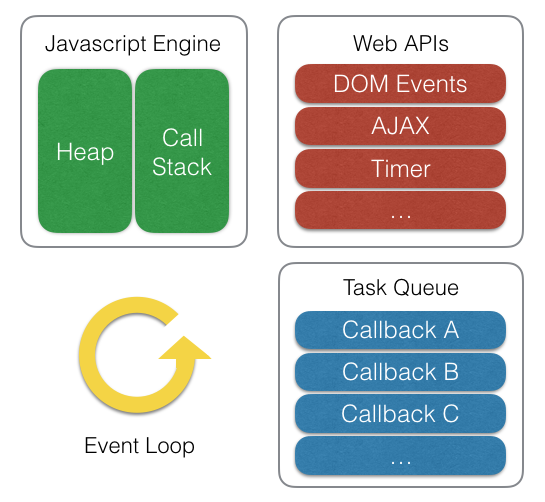

### Event Loop

- 자바스크립트는 싱글 스레드로 동작하지만, 비동기작업을 효율적으로 작동하기 위하여 이벤트 루프를 사용합니다. 

- 주요 구성 요소

1. 콜 스택(Call Stack): 자바스크립트 코드를 실행합니다.
2. 비동기 작업 처리: 비동기 함수 호출 시, 해당 작업은 웹 API에서 처리되고, 완료된 콜백 함수는 콜백 큐에 적재됩니다.
3. 이벤트 루프 작동: 이벤트 루프는 콜 스택이 비어 있는지 확인한 후, 비어 있다면 콜백 큐에서 대기 중인 콜백 함수를 콜 스택으로 옮겨 실행합니다.
4. 마이크로태스크 우선 처리: 이벤트 루프는 태스크 큐보다 마이크로태스크 큐를 우선적으로 처리합니다. 마이크로태스크 큐가 비워진 후에 태스크 큐를 처리합니다.


예제 코드 
```js
console.log("start")

setTimeout(() => {
  console.log('Timeout');
}, 0);

Promise.resolve().then(() => {
  console.log('Promise');
});

console.log('End');


// 예상 출력 순서:
// Start
// End
// Promise
// Timeout
```



- setTimeout 콜백은 태스크 큐에 적재되고, Promise 콜백은 마이크로태스크 큐에 적재됩니다. 이벤트 루프는 콜 스택이 비어지면, 마이크로태스크 큐를 우선 처리한 후 태스크 큐를 처리합니다.

- 이벤트 루프(Event Loop)는 이 비동기 함수 작업을 Web API에 옮기는 역할을 하고 작업이 완료되면 콜백을 큐(Queue)에 적재했다가 다시 자바스크립트 엔진에 적재해 수행시키는 일종의 '작업을 옮기는 역할' 만을 한다


---

### setTimeout 내부 동작 과정

```js
function bar() {
  setTimeout(() => {
    console.log("Second")
  }, 500);
}

function foo() {
  console.log("First");
}

function baz() {
  console.log("Third");
}

bar();
foo();
baz();


// First
// Third
// Second
```

실행 과정
1. bar() 함수가 호출되고 그안의 setTimeout() 함수가 호출되어 스택에 쌓인다.
2. setTimeout() 함수의 매개변수에 할당된 콜백 함수를 Timer Web API에 전달한다. 그리고 Timer Web API 에서는 백그라운드로 500 밀리초를 셈한다.
3. 다음 foo() 함수가 호출되고 콘솔창(output)에 "First" 가 출력된다.
4. 이때 500 밀리초 대기 시간이 만료되면서, 이벤트 루프는Timer Web API에서 가지고 있던 콜백 함수를 Task Queue 로 옮긴다.
5. 그다음 baz() 함수가 호출되고 콘솔창에 "Third" 가 출력된다.
6. 스택에 있는 모든 메인 자바스크립트 코드가 실행 완료 되어 Call Stack이 비워지게 된다.
7. 이벤트 루프는 Call Stack 이 비어있는 경우를 탐지하여, Task Queue 에 있는 콜백 함수를 Call Stack 으로 옮긴다.
8. Call Stack 에서 콜백 함수 코드를 실행하게 되고 콜솔창에는 "Second" 가 출력된다.


- 이 동작 원리의 핵심은 특정한 작업에 대해 비동기로 멀티 작업을 할 수 있다는 것이다. 비동기 동작 예시가 고작 타이머를 셈하는 setTimeout 이라 잘 와닿지 않을 수 있다. 하지만 파일 입출력이나 키보드 타이핑 하는 이벤트 동작일 경우라면 어떻까? 비동기가 없다면 파일을 다운 받거나 키보드를 타이핑 하는 동안에는 동안 웹사이트는 멈추게 되어 아무것도 못하게 될 것이다. 바로 이벤트 루프는 이러한 작업들을 별도로 브라우저의 멀티 스레드에게 인가하여 비동기로 처리해주는 핸들러 역할을 하는 것이다.


---

### TaskQ, Microtask Queue

- Callback Queue는 비동기 함수들의 콜백을 대기시키는 큐입니다. 두 가지 종류가 있습니다. task Queue와 MicrotaskQueue.
- Task Queue: `setTimeout`, `setInterval`, `fetch`, `addEventListener` 등의 콜백이 들어갑니다.
- Microtask Queue: `Promise.then`, `process.nextTick`, `MutationObserver` 등의 콜백이 들어갑니다.
- Microtask Queue는 최우선으로(브라우저 렌더링보다 먼저) 처리됩니다.


```js
console.log('Start!');

setTimeout(() => {
    console.log('Timeout!');
}, 0);

Promise.resolve('Promise!').then(res => console.log(res));

console.log('End!');

```
1. Call Stack에 console.log('Start!') 코드 부분이 쌓인 뒤 실행 되어 콘솔창에 "Start!" 가 출력


1. setTimeout 코드가 콜 스택에 적재되고 실행되면, 그 안의 콜백 함수가 이벤트 루프에 의해 Web API로 옮겨지고 타이머가 작동하게 된다. (0초라서 사실상 바로 타이머는 종료된다)


1. 타이머가 종료됨에 따라 setTimeout 의 콜백 함수는 MacroTask Queue에 이벤트 루프에 의해 적재되게 된다.
2. Promise 코드가 콜스택에 적재 되어 실행되고 then 핸들러의 콜백 함수가 이벤트 루프에 의해 MicroTask Queue에 적재되게 된다.


1. console.log('End!') 코드가 실행되고 "End!" 텍스트가 콘솔창에 출력된다.


1. 모든 메인 스레드의 자바스크립트 코드가 실행이되어 더이상 Call Stack엔 실행할 스택이 없어 비워지게 된다.
2. 그러면 이벤트 핸들러가 이를 감지하여, Callback Queue에 남아있는 콜백 함수들을 빼와 Call Stack에 적재하게 된다.
3. 이때 2종류의 Queue 중 MicroTask Queue에 남아있는 콜백이 우선적으로 처리된다. (만일 콜백이 여러개가 있다면 전부 처리된다)


1. MicroTask Queue가 비어지면, 이제 이벤트 루프는 MacroTask Queue에 있는 콜백 함수를 Call Stack에 적재해 실행되게 된다.


- 따라서 최종 코드의 실행 순서는 아래와 같이 된다.

- 최종 실행 순서: Start! -> End! -> Promise! -> Timeout!


```js
console.log('Start!');   // 1

setTimeout(() => {
    console.log('Timeout!');  // 4
}, 0);

Promise.resolve('Promise!').then(res => console.log(res));   // 3

console.log('End!');  // 2

```